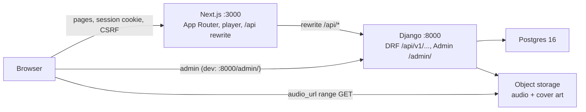
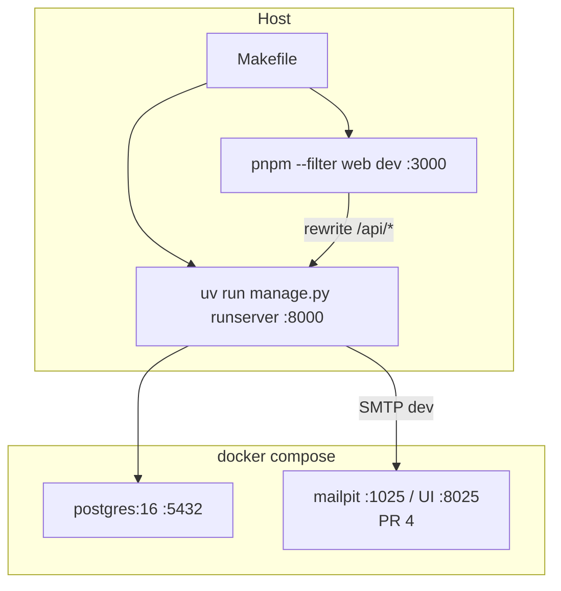
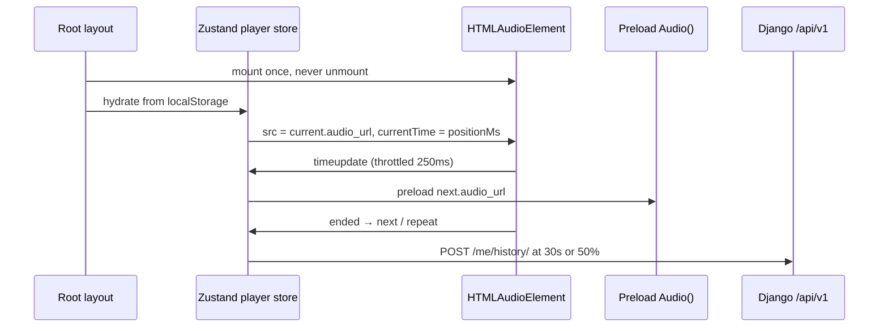
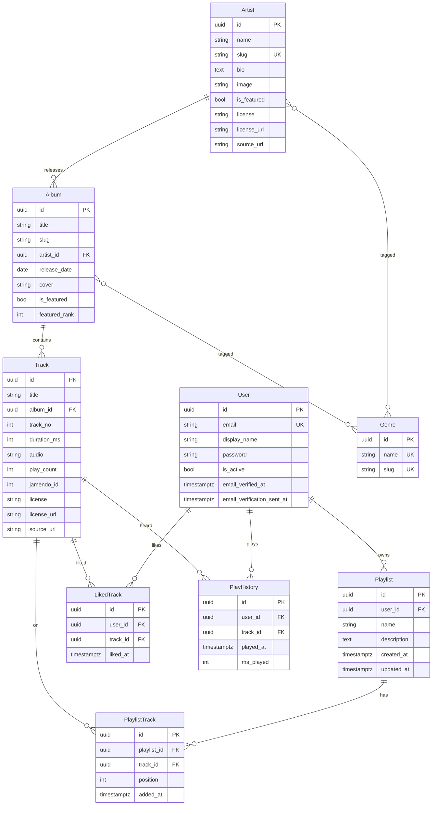
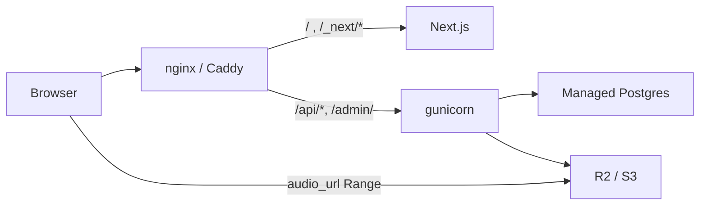

# Spotify v1 — System Design

| Field | Value |
|---|---|
| **Title** | Spotify: owned-catalog music streaming web app |
| **Author** | Engineering |
| **Date** | 2026-08-15 |
| **Status** | Draft |
| **Product** | Greenfield listener MVP (working name: Spotify) |
| **Repo** | `/Users/krishnamadhavan/Documents/xAI/spotify` |

This document is the implementation contract for v1. The repo today contains [`README.md`](/Users/krishnamadhavan/Documents/xAI/spotify/README.md) and this file (`docs/design.md`). There is no application source. Every path, model, and endpoint below is **proposed** and should be created during the PR plan — do not treat them as existing code.

---

## Overview

We are building a **web-only music streaming service** that we own end-to-end. We stream a **demo / Creative Commons catalog** we have the rights to play. This is not a Spotify Web API client and not a SoundCloud-style upload product.

The listener product is a dark, responsive web app that feels like Spotify desktop + mobile web: sign up, **verify email**, browse and search a Jamendo-seeded catalog, play from a persistent bar (verified sessions only), manage playlists and likes, and see recently played. The technical split is a **pnpm + uv monorepo**: Next.js (App Router, TypeScript, Tailwind, Zustand) owns the UI and the single HTML5 `<audio>` element; Django 5 + DRF owns users, sessions, catalog, search, playlists, likes, history, Home rails, and Admin. The browser talks only to Next.js; Next rewrites `/api/:path*` to Django. Postgres is the only datastore. Audio and cover art live in object storage (local `media/` in dev).

v1 is sized for a **single-user / small-demo** audience: tens of concurrent listeners, 200–400 tracks, API list/search p95 **< 200 ms** locally. We deliberately do not design for Spotify-scale, a second client, or a recommendation system.

---

## Background & Motivation

### Why this exists

The product goal is a **real owned service** with legal playback. Using the official Spotify Web API would mean we do not own playback, listeners need Premium, and the app is a client of someone else's catalog. A user-upload product would force transcoding, quotas, and moderation in v1. Both are rejected.

### Current state

The repository contains `README.md` and `docs/design.md`. There is no application source. The README already locks the product and stack:

- Own service + Creative Commons / sample catalog
- Web only; no native apps
- Core listener MVP (auth, browse/search, entities, playlists, likes, queue, player, history)
- Next.js + Django monorepo, same-origin `/api` proxy, Django session auth
- Queue is client-side; Django Admin + `manage.py seed_catalog` is the CMS

### Pain points this design prevents

| Pain | If we get it wrong |
|---|---|
| Playback dies on navigation | The clone feels fake. Audio **must** live in the Next root layout. |
| Empty catalog | Every screen is a placeholder. Seed is a v1 launch requirement, not polish. |
| CSRF / cookie Domain through the rewrite | Login “works” in browsable API and fails in the browser. |
| Scope creep | Lyrics, friends, offline, uploads look small and are multi-month features. |
| Licensing | Streaming audio we do not have rights to is a hard stop. |

---

## Goals & Non-Goals

### Goals (v1)

- Sign up, **verify email**, sign in, stay signed in (Django session + CSRF through the Next `/api` rewrite). Unverified accounts cannot play or mutate the library.
- Catalog seed is **Jamendo** CC tracks (8–15 artists, ~30–50 albums, 200–400 tracks).
- Home with **editorial** rails on seeded data: Featured, New, Recently played. Not a recommender.
- Browse artists, albums, and a small set of genre hubs.
- Search tracks, albums, artists, playlists via **Postgres full-text**.
- Entity pages: artist (popular tracks + albums), album tracklist, playlist tracklist.
- Library: Liked Songs, the user’s playlists, recently played.
- Playlists: create, rename, delete, add/remove tracks, reorder by `position`.
- Persistent player on every route: play/pause, seek, volume, next/prev, shuffle, repeat one/all.
- Client-side queue: view, add next, add last, jump, clear.
- Record play history after **30 seconds or 50%** of the track — not on click.
- Seeded catalog: **8–15 artists, ~30–50 albums, 200–400 tracks** with real durations, cover art, and streamable Jamendo files.
- Django Admin to load and edit the catalog.
- Local loop: `docker compose up postgres mailpit`, `make api`, `make web`, `make migrate`, `make seed`.

### Non-goals (v1)

Social graph, collaborative playlists, lyrics, podcasts, ads/premium, offline, Spotify Connect, user uploads, ML radio / Discover Weekly, native mobile, JWT + CORS for a second client, HLS/DASH/transcoding/full CDN, Meilisearch, Celery/Redis, Turborepo/Nx, per-track attribution ⓘ, public-read object storage.

Email verification **is a v1 goal** (sync `send_mail` + Mailpit in dev / SMTP or Mailu in prod). That is not a mailer product and does **not** add Celery.

Do **not** leak these into the v1 schema except where a later column is free (e.g. `Track` stores a file / key and the serializer already emits `audio_url`, which works unchanged when the storage backend is R2/S3).

---

## Personas (context)

| Persona | What they do in v1 |
|---|---|
| **Casual listener** | Play, skip, like, glance at recently played. |
| **Explorer** | Search, open artist/album pages, browse genre hubs. |
| **Curator** | Create, rename, reorder playlists; add/remove tracks. |

No social persona. No artist-uploader persona.

---

## Key Decisions

| Decision | Choice | Rationale |
|---|---|---|
| Product shape | Own service + CC/demo catalog | Legal playback we control; not a Spotify API wrapper. |
| Clients | Responsive web only | One UI surface; native is a different app. |
| Repo | Monorepo: `apps/web` (pnpm), `apps/api` (uv) | Two languages, one checkout; JS workspaces do not include Python. |
| Backend | Django 5 + DRF viewsets | Admin as CMS, viewsets + django-filter + browsable API. |
| Frontend | Next.js App Router + TS + Tailwind + Zustand | App shell, player, no second backend. |
| Data plane | Next **never** talks to Postgres | Django is the only API. No Route Handlers as a BFF. |
| Browser → API | Same-origin rewrite `/api/:path*` | Cookies and CSRF stay simple; no CORS in v1. |
| Admin routing | Django directly at `:8000/admin/` | Do not proxy `/admin` through Next. |
| Auth | Django session + CSRF, not JWT | One browser origin; JWT waits for a second client. |
| Search | Postgres FTS | Catalog is hundreds of rows; Meilisearch is out. |
| Queue | Zustand + `localStorage` | Not a table. Refresh resumes; no cross-device sync. |
| Playback | One `<audio>` in the root layout | Remounting on navigation kills playback. |
| Audio delivery | Object storage + HTTP range; Django does not proxy bytes in prod | Seek works; TTFB is storage, not gunicorn. |
| Prod audio URLs | **Signed GET URLs** via django-storages `STORAGES["default"]` | Not public-read. Serializer emits a time-limited URL only for **email-verified** sessions. |
| Catalog source | **Jamendo** CC tracks | Named source we have rights to stream; seed fetches or vendors files + attribution. |
| Public entity URLs | UUID in the path (`/artist/[id]`, `/album/[id]`) | Slugs exist for Admin/seed stability only. Genre hubs keep `/browse/genres/[slug]`. |
| Attribution chrome | Footer **`/credits` only** (DB-backed) | No per-track ⓘ in v1. License columns still exist for that page and Admin. |
| Email verification | **Required** before play or library writes | `email_verified_at` + `is_active`. Sync `send_mail`. Dev: Mailpit. Prod: SMTP (Mailu or any). No Celery. |
| Home | Seeded editorial flags + recency | Not embeddings, not a ranker. |
| Liked Songs | `LikedTrack` table, not a magic `Playlist` row | Avoids syncing a special playlist with likes. |
| IDs | UUID PKs on **all** public entities, including `User` | Opaque URLs; no sequential scraping; `User.id` is UUID so `/me/` and FKs match the ER. |
| User model | Custom `accounts.User` in **PR 1**, before the first `migrate` | Changing `AUTH_USER_MODEL` after `auth`/`contenttypes` migrations is a Django hard stop. |
| Catalog CMS | Django Admin + `seed_catalog` | No upload API in v1. |
| Attribution | `Track.license` / `license_url` / `source_url` in the DB | Credits must not drift from Admin edits; a static `manifest.json` page is not the catalog. |
| Dev media URLs | Absolute `MEDIA_URL` for `FileField.url`; mount `/media/` with `re_path` + `static.serve` | Never derive origin from the proxied `Host`. Do not pass absolute `MEDIA_URL` to `static()` — that helper no-ops when the prefix has a host. |
| CSRF bootstrap | Required `GET /api/v1/auth/csrf/` | Login/register need a cookie *before* POST; `@ensure_csrf_cookie` on 401 `me` is unreliable. |
| Browser origin (dev) | **Only** `http://localhost:3000` | `localhost` and `127.0.0.1` are different origins for cookies and `CSRF_TRUSTED_ORIGINS`. |
| JS monorepo tooling | Makefile + pnpm, not Turborepo/Nx | One JS app in v1 (`apps/web`); `packages/api-types` is a later follow-up. |
| Player library | HTML5 `<audio>`, not Howler | Add Howler only if codec/edge cases appear. |

---

## Proposed Design

### High-level architecture



**Request rules**

1. The browser’s document origin is Next. In dev that is **exactly** `http://localhost:3000` (never `http://127.0.0.1:3000`). In prod it is the public site origin.
2. All XHR/fetch from the web app goes to **same-origin** `/api/v1/...` (trailing slash required). Next rewrites that to Django.
3. Django Admin is **not** rewritten. In dev, staff open `http://localhost:8000/admin/`. In prod, the TLS terminator routes `/admin/` (and `/static/admin/`) to Django.
4. `<audio src={track.audio_url}>` and cover `` hit Django `:8000/media/...` in dev (absolute `MEDIA_URL`) or object storage in prod. `/media` is **not** rewritten through Next. These are cross-origin media loads from a `:3000` document; playback and image display **do not** need CORS. Do **not** add `django-cors-headers`. Django does **not** proxy every audio byte in production.

Production TLS terminator (nginx/Caddy):

```text
/api/*          → Django gunicorn
/admin/         → Django gunicorn
/static/admin/  → Django (WhiteNoise or collected static)
/media/         → not used in prod (audio/art on R2/S3)
/*              → Next.js
```

### Repository layout (to create)

JS workspaces stop at `apps/web`. Do **not** create `packages/api-types` in v1 — an empty workspace package breaks `pnpm --filter` for no gain. Hand-written types live in `apps/web/src/lib/types.ts` until a later OpenAPI follow-up. Python is `apps/api` with its own `uv` lockfile.

```text
/
  apps/
    web/                      # Next.js 15 App Router, TypeScript, Tailwind, Zustand
      src/
        app/                  # routes + root layout (owns <audio>)
        components/
        lib/                  # api client, csrf
        stores/               # player, auth
      next.config.ts
      package.json
    api/                      # Django 5.1 + DRF (uv, Python 3.12)
      pyproject.toml
      uv.lock
      manage.py
      config/                 # project package (settings, urls, wsgi)
      accounts/               # custom User — present from PR 1, before first migrate
      catalog/                # Genre, Artist, Album, Track + Admin + seed (PR 2)
      library/                # Playlist, PlaylistTrack, LikedTrack, PlayHistory (PR 2)
      search/                 # GET /search/ (PR 7)
      home/                   # GET /home/ (thin Featured/New in PR 5; recents in PR 7)
      core/                   # pagination, health, exception handler
  docker-compose.yml          # Postgres 16 (MinIO later, not v1-required)
  package.json                # pnpm workspace (apps/web only)
  pnpm-workspace.yaml         # packages: ["apps/web"]
  Makefile                    # make dev / make api / make web / make migrate / make seed
  .env.example
  README.md                   # already present
```

### Process topology (local)



Commands (proposed `Makefile` targets):

| Target | What it does |
|---|---|
| `make dev` | `docker compose up -d postgres mailpit` then prints how to run `make api` and `make web`. Mailpit UI: `http://localhost:8025`. |
| `make api` | `cd apps/api && uv run python manage.py runserver 8000` |
| `make web` | `pnpm --filter web dev` |
| `make migrate` | `uv run python manage.py migrate` |
| `make seed` | `uv run python manage.py seed_catalog` |
| `make test` | API: `uv run pytest` (unit / serializer / permission). Web unit tests are not a v1 gate. |
| `make test-auth-proxy` | PR 4 gate: `curl -c/-b` csrf → login. Asserts: no token → 403; token without `Origin` → 403; token + `Origin: http://localhost:3000` → 200 + `Set-Cookie`; then `me` → 200. Requires both servers. |

One root `.env.example`. Django loads `apps/api/.env` (or the root file via `django-environ`). Next reads `API_ORIGIN` **server-side only** for the rewrite.

### How Next talks to Django

Proposed `apps/web/next.config.ts`:

```ts
const API_ORIGIN = process.env.API_ORIGIN ?? "http://localhost:8000";

const nextConfig = {
  async rewrites() {
    return [
      { source: "/api/:path*", destination: `${API_ORIGIN}/api/:path*` },
    ];
  },
};

export default nextConfig;
```

**Do not** add a rewrite for `/admin`. **Do not** add Next Route Handlers that query Postgres.

Client fetch helper (proposed `apps/web/src/lib/api.ts`):

- `credentials: "include"` on every call.
- Mutations send `X-CSRFToken` read from the `csrftoken` cookie.
- Paths are root-relative **with trailing slashes** (`/api/v1/auth/login/`). Django `APPEND_SLASH` 301-converts a slashless POST into a GET and **drops the body**. Never strip trailing slashes.
- On first load of `/login` or `/signup`, `GET /api/v1/auth/csrf/` before any POST. On a 403 CSRF failure, refetch `/auth/csrf/` and retry the mutation **once**.
- 401 handling: redirect to `/login` for playlist / like / library mutations only. **Do not** redirect on `POST /me/history/` (guests/unverified skip that write) or on `GET /auth/me/` (anonymous is a valid state).
- 403 `email_not_verified`: route to `/check-email`, never to `/login`.

### Django project shape

Proposed packages under `apps/api/`:

| Package | Responsibility |
|---|---|
| `config` | `settings/{base,dev,prod}.py`, root `urls.py`, WSGI |
| `accounts` | Custom `User` from **PR 1** (`AUTH_USER_MODEL = "accounts.User"`). Auth + verify + resend land in PR 4. |
| `catalog` | `Genre`, `Artist`, `Album`, `Track` (incl. license columns); Admin; `seed_catalog` |
| `library` | `Playlist`, `PlaylistTrack`, `LikedTrack`, `PlayHistory` |
| `search` | `GET /api/v1/search/` — Postgres FTS, mixed payload (PR 7) |
| `home` | `GET /api/v1/home/` — Featured / New in PR 5; Recently played added in PR 7 |
| `core` | `HealthView`, pagination, exception handler |

`INSTALLED_APPS` must include `django.contrib.postgres` (for `SearchVectorField` / `GinIndex`) as soon as catalog models land, plus `rest_framework` and `django_filters`. `Pillow` is a required Python dep the moment `ImageField` exists (PR 2) — migrate/Admin crash without it.

DRF `DefaultRouter` registered from `config/urls.py` under `/api/v1/`. Viewsets, not ad-hoc function views. Auth actions live on an `AuthViewSet` (`@action`) or a small set of `GenericAPIView` classes mounted next to the router — not scattered `def login(request)`.

Global DRF settings (`config/settings/base.py`) — pin these so nobody “just adds JWT”:

```python
REST_FRAMEWORK = {
    "DEFAULT_AUTHENTICATION_CLASSES": [
        "rest_framework.authentication.SessionAuthentication",
    ],
    "DEFAULT_PERMISSION_CLASSES": [
        "rest_framework.permissions.AllowAny",  # tighten per viewset
    ],
    "DEFAULT_RENDERER_CLASSES": [
        "rest_framework.renderers.JSONRenderer",
        "rest_framework.renderers.BrowsableAPIRenderer",  # drop in prod
    ],
    "DEFAULT_FILTER_BACKENDS": [
        "django_filters.rest_framework.DjangoFilterBackend",
    ],
    "DEFAULT_PAGINATION_CLASS": "core.pagination.StandardPagination",
    "PAGE_SIZE": 20,
}
```

`SessionAuthentication` only. No `TokenAuthentication`, no JWT classes. Pagination max `page_size=50`.

### Playback architecture (non-negotiable)

This is where clones feel fake. Implement these rules exactly.



**Rules**

1. **Single `<audio>` in the Next root layout** (`apps/web/src/app/layout.tsx`). The layout itself stays a Server Component. A client `AudioEngine` is a **child** of the layout, not of any page, and must not receive `key={pathname}`. If it remounts on navigation, playback dies.
   - **React Strict Mode (dev):** effects double-invoke and the client tree remounts once. Do not call `audio.load()` when `src` is unchanged; on remount, restore `audio.currentTime` from `positionMs` in the store. The merge of PR 3 is not done if `next dev` restarts the track on the Strict Mode remount.
2. **Zustand owns the fields below.** `currentTrack` is **derived** (`queue[index] ?? null`), not stored. Pages dispatch intents (`playAlbum`, `addNext`, `toggleShuffle`); they do not touch the DOM audio node.
3. **Preload** the next track in a second `new Audio()` with `preload = "auto"` so Next is instant. On advance, swap `src` (or assign the preloaded element’s `src` onto the visible element) and start the following preload.
4. **Throttle** `timeupdate` → store writes to **250 ms**. Persist this snapshot to `localStorage` on that cadence and on `pause` / `pagehide`:

   `{ queue, index, shuffle, shuffleOrder, repeat, positionMs, volume, historyRecorded }`

   `trackId` is not its own field — it is `queue[index].trackId`. **Do not persist `isPlaying`.** On hydrate, `isPlaying` is always `false` (autoplay policy): resume is **paused** at `positionMs`. Hydrate only after mount (`persist` `skipHydration` + `useEffect`); writing `localStorage` during SSR mismatches HTML.
5. **History rule** (implement all four clauses):
   1. `POST /api/v1/me/history/` **once** when `currentTime >= 30` **or** `currentTime >= duration * 0.5`. Not on click. Not on skip before the threshold.
   2. **Reset** `historyRecorded = false` whenever the current id (`queue[index].trackId`) changes — skip, next, prev, jump, replace-queue. Otherwise only the first qualifying listen of the tab is recorded.
   3. **Persist** `historyRecorded` with the snapshot. Refresh at t=45s must **not** POST again.
   4. **Anonymous or unverified:** do not call `/me/history/` at all. A 401/403 here must **not** redirect to `/login`. Server additionally ignores another insert for the same `(user, track)` within 30 seconds so a missed persist cannot inflate `play_count`. After PR 4 the player itself will not start unless `email_verified`.
6. **Keyboard** (when focus is not in an input): Space play/pause; ←/→ seek ±5s; Shift+← / Shift+→ previous / next. Also wire **Media Session** metadata + `play` / `pause` / `previoustrack` / `nexttrack` / `seekto`. Keyboard + Media Session may land as PR 3.1 if PR 3’s review is already large; play/pause/seek/volume/next/prev/queue/persist/preload are the PR 3 gate.
7. **HTTP range requests** on audio. Seek must not restart the file. In prod, R2/S3 support `Range`. In dev, mount `/media/` with `re_path` + `django.views.static.serve` (honors `Range` in 5.x). Do **not** use `static(settings.MEDIA_URL)` while `MEDIA_URL` is absolute. Do not gzip audio.

Canonical store (`apps/web/src/stores/player.ts`) — this is the only contract:

```ts
type RepeatMode = "off" | "one" | "all";

type QueueItem = {
  trackId: string;
  // Snapshot enough to render the bar if the API is down after refresh
  title: string;
  artistName: string;
  albumTitle: string;
  coverUrl: string;
  audioUrl: string;
  durationMs: number;
};

type PlayerState = {
  queue: QueueItem[];
  index: number;
  shuffle: boolean;
  shuffleOrder: number[]; // permutation of queue indices; empty when shuffle is off
  repeat: RepeatMode;
  positionMs: number;
  volume: number; // 0..1
  isPlaying: boolean; // always false immediately after hydrate
  historyRecorded: boolean;
};

// derived, never persisted:
// currentTrack = queue[index] ?? null
// trackId      = currentTrack?.trackId ?? null
```

Queue is **not** a Postgres table. Cross-device sync is out of v1.

**Shuffle algebra** (must stay true after every mutation, not only the initial toggle):

- Toggle on: Fisher–Yates a bag of indices; keep the current index at the front of `shuffleOrder` so the current track does not jump.
- Toggle off: `shuffleOrder = []`; `index` stays on the same track.
- `addLast`: append to `queue`; if shuffling, append the new index to `shuffleOrder`.
- `addNext`: insert after the current queue index; rebuild `shuffleOrder` so the new index sits immediately after the current bag position (or reshuffle remaining indices, keeping current first).
- Remove / clear / replace-queue-with-album: rebuild `shuffleOrder` from the new `queue` (current stays put if it still exists). A stale permutation is a bug.
- “Next” walks `shuffleOrder` when `shuffle === true`. Reshuffle when the bag empties if `repeat === "all"`, else stop.

Repeat one: loop the current element (`audio.loop` or `ended` → seek 0 + play). Explicit next/prev still advances. Repeat-one does not by itself reset `historyRecorded` (same `trackId`); the 30s server debounce covers a looped replay.

### Next.js routes (App Router)

| Route | Page | Auth |
|---|---|---|
| `/` | Home rails (Featured / New from PR 5; Recently played from PR 7) | Public; Recently played empty if anonymous |
| `/login`, `/signup` | Auth forms. On mount: `GET /api/v1/auth/csrf/` | Redirect home if **verified**; unverified → `/check-email` |
| `/check-email` | “Check your inbox / resend” | Session optional; used after register and unverified login |
| `/verify-email` | Reads `?uid=&token=`, POSTs to Django | Public; success → login/home |
| `/search` | Search (`?q=`) | Public |
| `/browse` | Artists / albums index | Public |
| `/browse/genres/[slug]` | Genre hub | Public |
| `/artist/[id]` | Popular + albums | Public |
| `/album/[id]` | Tracklist | Public |
| `/playlist/[id]` | Tracklist; owner edit chrome | **Owner-only** (404 for everyone else). Public playlists are out of v1. |
| `/library` | Your playlists + recently played | Required |
| `/library/liked` | Liked Songs | Required |
| `/credits` | Attribution list from DB license fields. Footer link only — **no** per-track ⓘ | Public |

App chrome (sidebar: Home, Search, Browse, Library, playlist list; persistent player bar; queue panel) lives in the root layout so it does not remount.

**Playback is gated on a verified email.** Anonymous users may browse and search the catalog (pages, covers, metadata) but the player will not start and serializers omit `audio_url`. A session whose `email_verified_at` is null can log in and only sees `/check-email` + resend — no play, likes, playlists, or history. PR 3 (before auth exists) still plays against public `audio_url` so the player is demoable; PR 4 wires the gate.

### Seeded catalog

v1 does not ship an empty library.

| Entity | Target count |
|---|---|
| Artists | 8–15 |
| Albums | 30–50 |
| Tracks | 200–400 |
| Genres | 6–8 hubs (e.g. Electronic, Jazz, Classical, Hip-Hop, Folk, Ambient, Rock, Soundtrack) |

Each track has a **real** `duration_ms` matching the file, cover art on the album, and a streamable audio file (MP3 or AAC that Chromium + Firefox + Safari can play in `<audio>`). Prefer 128–192 kbps MP3 for compatibility.

**Licensing (stored on the row, not only in the seed manifest):** only files we have rights to stream. `Track` (and optional artist-level defaults) carry `license`, `license_url`, and `source_url`. Allowed `license` values:

`CC0` | `CC_BY` | `CC_BY_SA` | `CC_BY_NC` | `DEMO_INTERNAL`

`seed_catalog` **refuses** any other value and refuses a missing license on a track. Staff editing a file in Admin see and must keep these fields; `/credits` is a **query** over the same columns (via `GET /api/v1/credits/`), not a hand-edited markdown file that will drift from the DB. Attribution chrome is **footer `/credits` only** — no per-track ⓘ on the player or track table.

**Jamendo is the v1 source.** The seed pack is Jamendo tracks we have the right to stream under a listed CC license. Do not invent artists or ship All-Rights-Reserved files.

`apps/api/catalog/seed/manifest.json` is the source of truth for *which* Jamendo tracks we take. Each row:

```json
{
  "id": "stable-uuid",
  "jamendo_id": 1101234,
  "title": "Example Track",
  "artist_name": "Example Artist",
  "album_title": "Example Album",
  "track_no": 1,
  "duration_ms": 201000,
  "license": "CC_BY",
  "license_url": "https://creativecommons.org/licenses/by/3.0/",
  "source_url": "https://www.jamendo.com/track/1101234/example-track",
  "audio_download": "https://mp3d.jamendo.com/download/track/1101234/mp32/",
  "cover_download": "https://usercontent.jamendo.com/..."
}
```

`manage.py seed_catalog` (idempotent on `id` / `jamendo_id` / slugs):

1. Read the manifest (fail if a license is outside the allowlist or `source_url` is not a Jamendo URL).
2. For each row, if the audio/cover is not already in `MEDIA_ROOT` (or `SEED_ASSETS_DIR`), **download** from `audio_download` / `cover_download` (or the Jamendo API when `JAMENDO_CLIENT_ID` is set) and save onto the `FileField`s. Prefer vendoring a local `SEED_ASSETS_DIR` so CI and airplane demos do not hammer Jamendo.
3. Upsert Artist / Album / Track; copy `license`, `license_url`, `source_url` onto the track (artist-level defaults allowed).
4. Write `search_vector`. Featured albums get `featured_rank` 1..n.
5. Log counts; refuse to create a track without a stored file + license + `source_url`.

CI uses a **3-track Jamendo fixture** (small MP3s checked in under `catalog/seed/fixture/` or fetched once into the runner cache). Full 200–400 pack is documented in the manifest; do not commit ~1 GB to git.

Respect Jamendo’s API/ToS: identify the app, cache downloads, do not scrape HTML when the API or official download URL exists. `/credits` renders `source_url` as the Jamendo track page.

**Where files live**

- Dev: Django `FileField` on local `MEDIA_ROOT` (`apps/api/media/`). **`settings/dev.py` sets `MEDIA_URL = "http://localhost:8000/media/"`** (absolute, used **only** so `FileField.url` is already `http://localhost:8000/media/...`). Serializers return that string as-is. They must **not** call `request.build_absolute_uri` — under the Next rewrite the incoming `Host` can be `:3000` (or become `:3000` if `USE_X_FORWARDED_HOST` is copied from prod), and `/media` is not rewritten, so the player 404s.
- **Mount media on a path prefix. Do not pass absolute `MEDIA_URL` to `django.conf.urls.static.static()`** — that helper returns `[]` when the prefix has a netloc (`urlsplit(prefix).netloc` is truthy), even if `DEBUG=True`. The tutorial `urlpatterns += static(settings.MEDIA_URL, document_root=settings.MEDIA_ROOT)` therefore serves nothing and every `:8000/media/...` 404s. In `config/urls.py` (PR 2):

```python
# settings/dev.py
MEDIA_ROOT = BASE_DIR / "media"
MEDIA_URL = "http://localhost:8000/media/"  # FileField.url only; not a URLConf prefix

# config/urls.py — do NOT pass MEDIA_URL to static()
if settings.DEBUG:
    urlpatterns += [
        re_path(
            r"^media/(?P<path>.*)$",
            django.views.static.serve,  # FileResponse honors Range in 5.x
            {"document_root": settings.MEDIA_ROOT},
        ),
    ]
```

- One-line test (PR 2 or 3): catalog payload `audio_url` (and `cover_url`) **starts with** `http://localhost:8000/media/` in dev, **never** contains `:3000`. A GET of that URL on `:8000` returns 206/200 with `Accept-Ranges`, not 404.
- `<audio>` / `` from a `:3000` document to `:8000` are cross-origin media loads. They do **not** need CORS for playback or display. Do not add `django-cors-headers`.
- Prod: same fields; `STORAGES["default"]` is django-storages S3/R2 with **query-string signed GET URLs** (not a public-read bucket). Django does not stream the bytes. The DEBUG `re_path` is not mounted. TTL **6 hours**. The client re-fetches the track if a signed URL 403s. **Do not emit `audio_url` unless the request user is email-verified** (covers + metadata stay public).

Do **not** commit hundreds of megabytes of MP3s to git. `seed_catalog` should:

1. Insert rows from a checked-in JSON/YAML manifest (`apps/api/catalog/seed/manifest.json`).
2. Download or copy audio/art from a documented URL or a local `SEED_ASSETS_DIR` into storage.
3. Be idempotent (`slug` / stable UUID upsert).

Storage estimate (order of magnitude): 300 tracks × ~3.5 min × 128 kbps ≈ **0.8–1.0 GB** audio + ~10 MB covers. Postgres catalog is negligible (< 10 MB).

### Django Admin (catalog CMS)

Register `Genre`, `Artist`, `Album`, `Track` with inlines (`Track` inline on `Album`, ordered by `track_no`). Staff can fix titles, replace files, toggle `is_featured`, assign genres, and edit `license` / `license_url` / `source_url` (visible, not hidden). Featured albums must be seeded with `featured_rank` **1..n** (not 0); the Featured rail orders `featured_rank ASC` (lower = earlier).

Do **not** build a DRF upload endpoint in v1. Audio is not uploaded through the public API.

Listener `User` rows are visible in Admin (staff only) for support; playlists/likes/history are read-mostly in Admin.

### Scale assumptions (quantified)

| Dimension | v1 assumption |
|---|---|
| Concurrent listeners | Tens (demo / internal) |
| Catalog | Hundreds of tracks, not millions |
| API list/search | p95 **< 200 ms** on a local Postgres |
| Audio | TTFB from object storage; `Range` for seek |
| Play history writes | One POST per qualifying listen; no batch pipeline |
| Connections | Django runserver / a single gunicorn worker set is enough |

No Redis, no Celery, no read replicas, no CDN design beyond “put objects on R2/S3”.

---

## API / Interface Changes

All new. Version prefix: `/api/v1/`. JSON. DRF viewsets + `django-filter`. Pagination: `PageNumberPagination`, default `page_size=20`, max `50`.

### Auth (session + CSRF)

| Method | Path | Auth | Notes |
|---|---|---|---|
| `GET` | `/api/v1/auth/csrf/` | Public (`AllowAny`) | **Required** bootstrap. `@ensure_csrf_cookie` on `dispatch`. Body `{ "detail": "ok" }`. Login, signup, verify, and resend pages call this on mount (and after a 403 CSRF, once). |
| `POST` | `/api/v1/auth/register/` | Public + **explicit CSRF** | `{ email, password, display_name }` → creates user with `is_active=False`, `email_verified_at=None`, **sends verification email** (sync `send_mail`), logs them in so `/me/` works, returns `email_verified: false`. They are **not** a listener yet. |
| `POST` | `/api/v1/auth/login/` | Public + **explicit CSRF** | `{ email, password }` → session cookie even if unverified (custom login; stock `authenticate()` rejects `is_active=False`). Body / `/me/` still report `email_verified: false`. Front-end routes unverified sessions to `/check-email`. Wrong password → 400. |
| `POST` | `/api/v1/auth/logout/` | Session | `logout()`, CSRF required (stock DRF already enforces this for authenticated requests) |
| `GET` | `/api/v1/auth/me/` | Session or 401 | `{ id, email, display_name, email_verified }`. Do **not** rely on this to set the CSRF cookie before login. |
| `POST` | `/api/v1/auth/verify-email/` | Public + **explicit CSRF** | `{ uid, token }` from the Next `/verify-email?uid=&token=` page. Valid token → `is_active=True`, `email_verified_at=now()`, `login()`, `{ email_verified: true }`. Invalid/expired → 400 `{"detail": "Invalid or expired verification link"}`. |
| `GET` | `/api/v1/auth/verify-email/` | Public | Optional echo `{ "detail": "POST uid and token" }`. The link lands on **Next**, not this GET. |
| `POST` | `/api/v1/auth/resend-verification/` | Public + **explicit CSRF** | `{ email }` or the session user. Always `200 {"detail": "ok"}` (do not leak whether the email exists). If an unverified user exists and `email_verification_sent_at` is older than 60s, send again. Verified users: no-op 200. |

**Why login/register need an extra CSRF hook.** `SessionAuthentication.authenticate()` calls `enforce_csrf` only when a session user is already present. Anonymous `POST /auth/login/` and `POST /auth/register/` therefore **skip CSRF** under stock DRF. That contradicts “CSRF on auth mutations.” Use one of these (pick the mixin; do not leave it implicit):

```python
class SessionAuthenticationEnforceCSRF(SessionAuthentication):
    """Always run CSRF, including anonymous login/register."""

    def authenticate(self, request):
        result = super().authenticate(request)
        if result is None:
            self.enforce_csrf(request)
        return result
```

Set this class as `authentication_classes` on login, register, **verify-email**, and **resend-verification** (global `SessionAuthentication` can stay for the rest). Do **not** mark those views `csrf_exempt`.

### Email verification (required)

Sign up is **not** immediately usable. Play, likes, playlists, and history require `email_verified_at` to be set.

**User fields**

- `is_active` default **False**. Set True on successful verify. `createsuperuser` / staff must start verified (`is_active=True`, `email_verified_at=now()`) so Admin works.
- `email_verified_at` nullable `DateTimeField`. Source of truth for the product gate (`email_verified = email_verified_at is not None`).
- `email_verification_sent_at` nullable, for the 60s resend throttle. No extra token table — Django `default_token_generator` + `urlsafe_base64_encode(user.pk)`.

**Mail**

- `send_mail` is **synchronous** in v1. No Celery, no Redis, no outbox worker.
- Link in the message: `{FRONTEND_ORIGIN}/verify-email?uid={uid}&token={token}` (Next, not Django). Token lifetime: `PASSWORD_RESET_TIMEOUT` (default 3 days; pin **24 hours** in settings).
- Dev: **Mailpit** in `docker-compose.yml` (`axllent/mailpit`, SMTP `1025`, UI `http://localhost:8025`). `EMAIL_HOST=localhost`, `EMAIL_PORT=1025`, no auth. Default `make dev` starts postgres **and** Mailpit.
- Prod: any SMTP via env (`EMAIL_HOST`, `EMAIL_PORT`, `EMAIL_HOST_USER`, `EMAIL_HOST_PASSWORD`, `EMAIL_USE_TLS`, `DEFAULT_FROM_EMAIL`). **Mailu** is the prod-shaped option. Do **not** run Mailu in default `make dev` — it is heavy. Ship `docker-compose.mailu.yml` (or a compose profile `mailu`) as documentation only; Django only speaks SMTP, so swapping Mailpit → Mailu is env-only.
- Permission class `IsVerifiedEmail`: authenticated **and** `email_verified_at` is set. Used on likes, playlists, history, and anywhere that would emit `audio_url`. Unverified session → **403** `{"detail": "email_not_verified"}` (not 401 — they have a session; the client must not treat this as “redirect to login”).

**Cookie contract (dev)**

| Cookie | HttpOnly | Readable by JS | Path | Domain | SameSite | Secure (dev/prod) | Age |
|---|---|---|---|---|---|---|---|
| `sessionid` | yes | no | `/` | unset | `Lax` | false / true | 14 days |
| `csrftoken` | **no** | yes | `/` | unset | `Lax` | false / true | Django default |

Because the browser posted to `http://localhost:3000/api/v1/auth/login/` and Next proxied the response, `Set-Cookie` is stored for host `localhost` (port is **not** part of the cookie key). Django must **not** set `SESSION_COOKIE_DOMAIN` or `CSRF_COOKIE_DOMAIN`. A listener session on `:3000` is also sent to `:8000/admin/` (and the reverse). Logout on either origin invalidates the shared session. Fine if staff know; surprising if not.

Required Django settings (dev):

```python
SESSION_COOKIE_SAMESITE = "Lax"
SESSION_COOKIE_PATH = "/"
SESSION_COOKIE_AGE = 60 * 60 * 24 * 14
# SESSION_COOKIE_DOMAIN  # unset
SESSION_COOKIE_SECURE = False  # True in prod

CSRF_COOKIE_SAMESITE = "Lax"
CSRF_COOKIE_PATH = "/"
CSRF_COOKIE_HTTPONLY = False
CSRF_USE_SESSIONS = False      # JS must read the cookie
# CSRF_COOKIE_DOMAIN           # unset
CSRF_COOKIE_SECURE = False     # True in prod
CSRF_TRUSTED_ORIGINS = ["http://localhost:3000"]
# Do not add http://127.0.0.1:3000. Do not open the app on that host.
```

Mutating fetch from Next:

```ts
headers: {
  "Content-Type": "application/json",
  "X-CSRFToken": readCookie("csrftoken"),
}
credentials: "include"
```

JWT is out until a second client exists.

### Catalog (read-heavy)

| Method | Path | Filter / notes |
|---|---|---|
| `GET` | `/api/v1/artists/` | `?genre=<slug>` |
| `GET` | `/api/v1/artists/{id}/` | Nested `popular` (top 10 by `play_count`) + `albums` summary |
| `GET` | `/api/v1/albums/` | `?artist=<uuid>`, `?genre=<slug>`, `?featured=true` (then `featured_rank ASC`, then title) |
| `GET` | `/api/v1/albums/{id}/` | Nested `tracks` in `track_no` order |
| `GET` | `/api/v1/tracks/` | `?album=<uuid>`, `?artist=<uuid>` — **`artist` filters `album__artist`**. `select_related("album__artist")`. There is no `Track.artist_id`. |
| `GET` | `/api/v1/tracks/{id}/` | Includes `audio_url`, `duration_ms`, `license`, `license_url`, `source_url` |
| `GET` | `/api/v1/genres/` | Hub list |
| `GET` | `/api/v1/genres/{slug}/` | `{ genre, artists, albums }` |
| `GET` | `/api/v1/credits/` | Paginated attribution rows from Track (+ artist name). Source of `/credits`. |

Catalog writes are Admin-only, not public POST/PATCH.

### Search

`GET /api/v1/search/?q=`

- `django.contrib.postgres` is in `INSTALLED_APPS` (PR 2). Config is **`simple`** (no stemming of “The”).
- Stored `SearchVectorField` + `GinIndex` + `SearchRank`. Vectors are **not** title-only — otherwise searching an artist name returns the artist and empty track/album groups:

| Model | Vector (weights) |
|---|---|
| `Artist` | `name` (A) |
| `Album` | `title` (A) + `artist.name` (B) |
| `Track` | `title` (A) + `album.title` (B) + `album.artist.name` (B) |
| `Playlist` | `name` (A); only the requesting user’s rows (none if anonymous) |

- Update vectors in `save()` **and** in `seed_catalog` via `SearchVector(...)` / `update`, because `bulk_create` skips `save()`. Seed leaving `search_vector` null is a bug.
- `q` min length 2; empty → 400.
- **Cap each group at 20** (unpaginated mixed payload; do not dump all 400 tracks for `q=al`).
- Response is **mixed, grouped**:

```json
{
  "q": "noon",
  "artists": [{ "id": "...", "name": "...", "image_url": "..." }],
  "albums": [{ "id": "...", "title": "...", "artist": {...}, "cover_url": "..." }],
  "tracks": [{ "id": "...", "title": "...", "artist": {...}, "album": {...}, "duration_ms": 201000 }],
  "playlists": [{ "id": "...", "name": "...", "track_count": 12 }]
}
```

`SearchVectorField` + `GinIndex` land **with the models in PR 2** (seed writes them). The search endpoint itself is PR 7. Do not add the column in PR 2 and forget to populate it until PR 7.

### Playlists

| Method | Path | Notes |
|---|---|---|
| `GET` | `/api/v1/playlists/` | Current user’s playlists |
| `POST` | `/api/v1/playlists/` | `{ name, description? }` |
| `GET` | `/api/v1/playlists/{id}/` | Nested tracks in `position` order; **404 if not owner** |
| `PATCH` | `/api/v1/playlists/{id}/` | Rename / description |
| `DELETE` | `/api/v1/playlists/{id}/` | Owner only |
| `POST` | `/api/v1/playlists/{id}/tracks/` | `{ track_id }` appends at `max(position)+1`. `position` is **0-based**. Touches `playlist.updated_at`. |
| `DELETE` | `/api/v1/playlists/{id}/tracks/{playlist_track_id}/` | Remove one row; compact positions; touch `updated_at`. |
| `POST` | `/api/v1/playlists/{id}/tracks/reorder/` | `{ ordered_ids: [playlist_track_id, ...] }` inside `transaction.atomic()`. `ordered_ids` **must be a permutation** of the existing item ids — otherwise **400** `{"detail": "ordered_ids must be a permutation of playlist tracks"}`. Rewrite `position` to dense `0..n-1`. Touch `playlist.save(update_fields=["updated_at"])` in the same transaction. Two concurrent reorders: last writer wins; unique `(playlist, position)` is optional at demo scale if the rewrite is always dense and transactional. |

Duplicates: **one row per (playlist, track)** (`unique_together`). Adding an existing track is `400` `{"detail": "Track already in playlist"}`, not a silent no-op.

`Playlist.updated_at` is `auto_now` and will **not** change when only `PlaylistTrack` rows are saved. Every add / remove / reorder **must** call `playlist.save(update_fields=["updated_at"])` so Library “recently updated” is correct.

### Likes (Liked Songs)

| Method | Path | Notes |
|---|---|---|
| `GET` | `/api/v1/likes/` | Tracks the user liked, newest first |
| `POST` | `/api/v1/likes/` | `{ track_id }` — idempotent create |
| `DELETE` | `/api/v1/likes/{track_id}/` | Unlike |

Liked Songs is **not** a `Playlist` row.

### History & recents

| Method | Path | Notes |
|---|---|---|
| `POST` | `/api/v1/me/history/` | **Verified** session. `{ track_id, ms_played }`. Client only calls after 30s or 50%, and only when `user.email_verified`. Anonymous: do not call. Unverified: do not call (a 403 here must **not** redirect to `/login`). |
| `GET` | `/api/v1/me/history/` | Paginated raw events (debug / “full history” if we show it) |
| `GET` | `/api/v1/me/recently-played/` | Distinct tracks, latest `played_at`, limit 50 |

Server still rejects `ms_played < 0` or `> duration_ms + slack`, and unknown `track_id`. Increment `Track.play_count` with `F("play_count") + 1` on a successful insert (artist “Popular”). **Debounce:** if the same `(user, track)` was inserted in the last 30 seconds, return `200` with the existing row and do **not** increment `play_count`. This covers refresh-at-t=45s if `historyRecorded` failed to persist.

### Home

`GET /api/v1/home/`

```json
{
  "rails": [
    { "id": "featured", "title": "Featured", "items": [/* Album cards */] },
    { "id": "new", "title": "New releases", "items": [/* Album cards by release_date desc */] },
    { "id": "recently-played", "title": "Recently played", "items": [/* Track or Album cards */] }
  ]
}
```

- **Featured:** `Album.is_featured=True` (and optionally `Artist.is_featured`), ordered by **`featured_rank ASC`** (lower = earlier) then title. Seed featured albums with ranks **1..n**, never leave them at the default `0`.
- **New:** albums by `release_date` desc, limit ~12.
- **Recently played:** same query as `/me/recently-played/` (empty array if anonymous). Added in PR 7; PR 5’s Home ships Featured + New only.

No personalization model. No “because you listened to X”.

### Health

`GET /api/v1/health/` → `{ "status": "ok", "db": "ok" }` (runs `SELECT 1`). Used by compose/prod probes. Unauthenticated.

### Serializer conventions

- IDs are UUID strings (including `User.id`).
- Money, lyrics, preview clips, ISRC, explicit flags: **omit** unless needed. `duration_ms` is required.
- Nested artist/album on tracks are thin (`id`, `name`/`title`, `cover_url`) to keep list payloads small.
- Track serializers expose `license`, `license_url`, `source_url` for `/credits` and Admin — **not** for a per-track ⓘ in the player.
- `cover_url` is `FileField.url` as-is (public). `audio_url` is `FileField.url` (dev absolute `MEDIA_URL`, prod **signed** via `STORAGES["default"]`) **only when** `request.user` is authenticated and `email_verified_at` is set; otherwise `null`. Never `request.build_absolute_uri`. Never store a signed URL in the row. Never public-read in prod.
- Snake_case JSON on the wire. The Next client may camelCase at the boundary in `api.ts`. Pick one in PR 1 and stick to it. **Recommendation:** snake_case on the wire, map in the client.
- **Business-rule 400s** use `{"detail": "<message>"}` (e.g. `{"detail": "Track already in playlist"}`). Field-validation 400s stay DRF’s `{"field": ["..."]}`. Likes stay idempotent (`200`/`201`), not a 400.

### Permissions matrix

| Surface | Anonymous | Session, unverified | Verified | Staff |
|---|---|---|---|---|
| Catalog GET, search, home (non-recent), `/credits/` (metadata + covers) | allow | allow | allow | allow |
| `audio_url` / play | `null` / blocked | `null` / blocked | signed (prod) or `:8000/media` (dev) | allow |
| Playlists / likes / history / recents | 401 | **403** `email_not_verified` | owner only | Admin can inspect |
| verify / resend / csrf / register / login | allow | allow | allow | allow |
| Catalog POST/PATCH via API | deny | deny | deny | deny (use Admin) |
| `/admin/` | deny | deny | deny unless `is_staff` | allow |

---

## Data Model Changes

Greenfield schema. All new tables. UUID primary keys unless noted.



### Proposed Django models

Custom user (`accounts.User`):

```python
class User(AbstractUser):
    id = models.UUIDField(primary_key=True, default=uuid.uuid4, editable=False)
    username = None
    email = models.EmailField(unique=True)
    display_name = models.CharField(max_length=80)
    # AbstractUser.is_active stays; default False in save()/manager for register.
    email_verified_at = models.DateTimeField(null=True, blank=True)
    email_verification_sent_at = models.DateTimeField(null=True, blank=True)
    USERNAME_FIELD = "email"
    REQUIRED_FIELDS = ["display_name"]

    @property
    def email_verified(self) -> bool:
        return self.email_verified_at is not None
```

This model (and `AUTH_USER_MODEL = "accounts.User"`) ships in **PR 1**. The first `make migrate` must create `accounts.User`, never default `auth.User`. Verification fields can land in PR 1 (nullable, unused) or a PR 4 migration; do not change `AUTH_USER_MODEL` in PR 4.

Catalog (`catalog`):

```python
class Genre(models.Model):
    id = models.UUIDField(primary_key=True, default=uuid.uuid4, editable=False)
    name = models.CharField(max_length=80, unique=True)
    slug = models.SlugField(unique=True)
    description = models.TextField(blank=True)
    # optional hub image via ImageField

class License(models.TextChoices):
    CC0 = "CC0", "CC0"
    CC_BY = "CC_BY", "CC BY"
    CC_BY_SA = "CC_BY_SA", "CC BY-SA"
    CC_BY_NC = "CC_BY_NC", "CC BY-NC"
    DEMO_INTERNAL = "DEMO_INTERNAL", "Internal demo (rights held)"

class Artist(models.Model):
    id = models.UUIDField(primary_key=True, default=uuid.uuid4, editable=False)
    name = models.CharField(max_length=200)
    slug = models.SlugField(unique=True)
    bio = models.TextField(blank=True)
    image = models.ImageField(upload_to="artists/", blank=True)
    genres = models.ManyToManyField(Genre, related_name="artists", blank=True)
    is_featured = models.BooleanField(default=False)
    # Optional defaults copied onto tracks at seed time if the track omits them
    license = models.CharField(max_length=32, choices=License.choices, blank=True)
    license_url = models.URLField(blank=True)
    source_url = models.URLField(blank=True)
    search_vector = SearchVectorField(null=True)

    class Meta:
        indexes = [GinIndex(fields=["search_vector"])]

class Album(models.Model):
    id = models.UUIDField(primary_key=True, default=uuid.uuid4, editable=False)
    title = models.CharField(max_length=200)
    slug = models.SlugField()
    # Single album artist. Compilations and featured-artist FKs are out of v1 —
    # do not add a second artist relation in Admin "just in case."
    artist = models.ForeignKey(Artist, related_name="albums", on_delete=models.CASCADE)
    release_date = models.DateField()
    cover = models.ImageField(upload_to="covers/")
    genres = models.ManyToManyField(Genre, related_name="albums", blank=True)
    is_featured = models.BooleanField(default=False)
    featured_rank = models.PositiveSmallIntegerField(default=0)  # seed featured as 1..n
    search_vector = SearchVectorField(null=True)

    class Meta:
        unique_together = [("artist", "slug")]
        ordering = ["-release_date", "title"]
        indexes = [GinIndex(fields=["search_vector"])]

class Track(models.Model):
    id = models.UUIDField(primary_key=True, default=uuid.uuid4, editable=False)
    title = models.CharField(max_length=200)
    album = models.ForeignKey(Album, related_name="tracks", on_delete=models.CASCADE)
    track_no = models.PositiveSmallIntegerField()
    duration_ms = models.PositiveIntegerField()
    audio = models.FileField(upload_to="audio/")
    play_count = models.PositiveIntegerField(default=0)
    jamendo_id = models.PositiveIntegerField(unique=True, null=True, blank=True)
    license = models.CharField(max_length=32, choices=License.choices)  # required; seed-enforced
    license_url = models.URLField()
    source_url = models.URLField()
    search_vector = SearchVectorField(null=True)

    class Meta:
        unique_together = [("album", "track_no")]
        ordering = ["track_no"]
        indexes = [GinIndex(fields=["search_vector"])]
```

Artist on a track is **derived from `album.artist`**. No featured-artist M2M in v1. Serializers expose `artist` from the album to keep the client simple. `GET /tracks/?artist=` filters `album__artist_id`.

Library (`library`):

```python
class Playlist(models.Model):
    id = models.UUIDField(primary_key=True, default=uuid.uuid4, editable=False)
    user = models.ForeignKey(settings.AUTH_USER_MODEL, related_name="playlists", on_delete=models.CASCADE)
    name = models.CharField(max_length=120)
    description = models.TextField(blank=True)
    created_at = models.DateTimeField(auto_now_add=True)
    updated_at = models.DateTimeField(auto_now=True)  # also touched explicitly on item mutations
    search_vector = SearchVectorField(null=True)

    class Meta:
        indexes = [GinIndex(fields=["search_vector"])]

class PlaylistTrack(models.Model):
    id = models.UUIDField(primary_key=True, default=uuid.uuid4, editable=False)
    playlist = models.ForeignKey(Playlist, related_name="items", on_delete=models.CASCADE)
    track = models.ForeignKey("catalog.Track", on_delete=models.CASCADE)
    position = models.PositiveIntegerField()  # 0-based; 0 is valid. Dense 0..n-1 after every rewrite.
    added_at = models.DateTimeField(auto_now_add=True)

    class Meta:
        unique_together = [("playlist", "track")]
        ordering = ["position"]
        indexes = [models.Index(fields=["playlist", "position"])]

class LikedTrack(models.Model):
    id = models.UUIDField(primary_key=True, default=uuid.uuid4, editable=False)
    user = models.ForeignKey(settings.AUTH_USER_MODEL, related_name="likes", on_delete=models.CASCADE)
    track = models.ForeignKey("catalog.Track", on_delete=models.CASCADE)
    liked_at = models.DateTimeField(auto_now_add=True)

    class Meta:
        unique_together = [("user", "track")]
        ordering = ["-liked_at"]

class PlayHistory(models.Model):
    id = models.UUIDField(primary_key=True, default=uuid.uuid4, editable=False)
    user = models.ForeignKey(settings.AUTH_USER_MODEL, related_name="play_history", on_delete=models.CASCADE)
    track = models.ForeignKey("catalog.Track", on_delete=models.CASCADE)
    played_at = models.DateTimeField(auto_now_add=True)
    ms_played = models.PositiveIntegerField()

    class Meta:
        indexes = [models.Index(fields=["user", "-played_at"])]
        ordering = ["-played_at"]
```

**Not a table:** Queue, shuffle bag, repeat mode, playback position, volume.

### What we deliberately do not add

| Tempting column / table | Why not in v1 |
|---|---|
| `Follow`, `Friend`, `FeedItem` | No social graph |
| `Playlist.collaborators` | No collaborative playlists |
| `Track.lyrics`, `LyricLine` | No lyrics |
| `Show`, `Episode` | No podcasts |
| `Subscription`, `AdBreak` | No ads / premium |
| `Download`, `OfflineGrant` | No offline |
| `Device`, `ConnectSession` | No Connect |
| `Upload`, `TranscodeJob` | No uploads / Celery |
| `Recommendation`, embeddings | Home is editorial |
| Refresh-token / JWT tables | Session auth |

`Track.audio` / `Album.cover` as `FileField` is the “free later column”: swapping the storage backend to R2/S3 does not change the schema.

### Indexes & constraints

- `Track(album, track_no)` unique
- `PlaylistTrack(playlist, position)` indexed (not unique — rewrite is dense + transactional); unique `(playlist, track)`
- `LikedTrack` unique `(user, track)`
- `PlayHistory(user, played_at desc)`
- `GinIndex` on each `search_vector` (`Artist`, `Album`, `Track`, `Playlist`) — declared on the model `Meta.indexes` in PR 2
- `Artist.slug` unique; `(Album.artist, Album.slug)` unique

### Migration strategy

Linear Django migrations from empty. No data backfill. Order:

1. **PR 1:** custom `accounts.User` + `AUTH_USER_MODEL`. This is the first migrate. Wiping the DB later to swap the user model is not an acceptable recovery path.
2. **PR 2:** catalog + library tables, `SearchVectorField` + `GinIndex`, license columns. One migration per remaining app.
3. Seed is a **management command**, not a data migration, so CI can run migrate without fetching 1 GB of audio. Seed **writes** `search_vector` (no `bulk_create` without a follow-up `update`).

### `audio_url` computation

Do **not** derive the origin from the request.

```python
# settings/dev.py
MEDIA_ROOT = BASE_DIR / "media"
MEDIA_URL = "http://localhost:8000/media/"  # FileField.url only
# USE_X_FORWARDED_HOST stays False in dev

# config/urls.py — static(MEDIA_URL) is a no-op when MEDIA_URL has a host. Mount the path:
if settings.DEBUG:
    urlpatterns += [
        re_path(
            r"^media/(?P<path>.*)$",
            django.views.static.serve,
            {"document_root": settings.MEDIA_ROOT},
        ),
    ]

# TrackSerializer.get_audio_url — never build_absolute_uri
# if not verified(request.user): return None
# return obj.audio.url  # absolute MEDIA_URL in dev; signed S3/R2 URL in prod
# cover_url is always obj.cover.url
```

In production, set `STORAGES["default"]` to django-storages S3/R2 (Django 5; **not** the deprecated `DEFAULT_FILE_STORAGE`) with **querystring auth** (not public-read). `.url` is a signed GET. TTL **6 hours**. The client re-fetches the track if the URL expires (403).

Test (after PR 4): verified session → `audio_url.startswith("http://localhost:8000/media/")` and `":3000" not in audio_url`. Anonymous / unverified → `audio_url is null`.

---

## Web app design (Next.js)

### Shell

- Dark theme (near-black background, light text, green accent — Spotify-like, not a trademark clone of logomarks).
- Left sidebar (collapses to icons / bottom nav on small screens): Home, Search, Browse, Library, playlist list.
- Main scroll region is the route `children`.
- Bottom **player bar** always mounted: cover, title/artist, like, transport, seek, volume, queue toggle, shuffle, repeat.
- Queue panel: slide-over listing the store queue; jump / remove / clear.

### Data fetching

- Public catalog pages: Server Components calling Django **from the Next server** (`API_ORIGIN`, no browser cookie) **or** client fetch to `/api/v1` after hydration.
- **Recommendation:** client-side fetch to `/api/...` for anything that needs the session cookie (Home recents, likes, playlists). Public album/artist pages may be server-fetched for faster first paint using `API_ORIGIN` and no `Set-Cookie` dependency.
- Do **not** put DB code in Server Actions.

### Auth UX

- `AuthStore` holds `user | null` from `GET /me/` on layout mount (`email_verified` included). 401 on `me` means anonymous — not a redirect.
- `/login` and `/signup` call `GET /api/v1/auth/csrf/` on mount, then POST. On 403 CSRF, refetch csrf and retry once.
- After **register**: land on `/check-email` (session exists, `email_verified: false`). Show Mailpit hint in dev (`http://localhost:8025`).
- After **login**: if `email_verified`, `router.push("/")`; else `/check-email`.
- `/verify-email?uid=&token=`: GET csrf, POST `{ uid, token }` to `/api/v1/auth/verify-email/`, then home. Expired link offers resend.
- `/check-email`: resend button → POST `/api/v1/auth/resend-verification/` (CSRF). Always pretends success.
- 401 on playlist / like / library mutations → `/login`. 403 `email_not_verified` → `/check-email`. **Never** redirect `GET /auth/me/` or `POST /me/history/` to login.
- Play click without a verified session: prompt “Verify your email to play” / “Sign in” — do not start `<audio>`.
- Stay signed in: session cookie (`SESSION_COOKIE_AGE = 60 * 60 * 24 * 14`). No “remember me” checkbox. Not `SESSION_EXPIRE_AT_BROWSER_CLOSE`. Verification is still required on that session until the link is used.

### Player UX details

- Clicking a track in an album: replace queue with the album tracklist, set index, play; rebuild `shuffleOrder` if shuffle is on.
- Clicking a playlist track: same with playlist order.
- “Add to queue” / “Play next”: mutate the Zustand queue only; update `shuffleOrder` per the shuffle algebra above.
- Liked state on the bar: optimistic `POST/DELETE /likes/` (verified session; guests see sign-in, unverified see “verify email”, never a 401 bounce mid-play).
- Seeking: `audio.currentTime = ...` (requires range support).
- Volume: 0–1, persisted.
- Refresh: restore queue and `positionMs`, **paused**. User hits play.

### Accessibility

- Transport buttons have names.
- Seek slider is a labeled `<input type="range">`.
- Keyboard shortcuts listed in a small `/shortcuts` dialog later if needed; v1 implements the keys regardless.

---

## Local dev / production

### Dev

Always open **`http://localhost:3000`**, never `http://127.0.0.1:3000`. Document this in the README loop.

```text
docker compose up postgres mailpit   # Postgres 16 + Mailpit SMTP :1025 / UI :8025
make migrate                         # first migrate = custom accounts.User
make seed                            # Jamendo manifest → MEDIA_ROOT; search_vector + licenses
make api                             # :8000  (Admin at /admin/)
make web                             # :3000  (rewrite /api → :8000)
# open http://localhost:8025 to read verification mail
```

### Runtime pins (lock these in PR 1)

| Piece | Version |
|---|---|
| Python | 3.12 |
| Node | 20 LTS |
| Next.js | 15.x |
| TypeScript | 5.x |
| Tailwind | 3.x |
| Zustand | 5.x |
| Django | 5.1.x |
| djangorestframework | 3.15.x |
| django-filter | 24.x |
| django-environ | 0.11.x |
| psycopg | `psycopg[binary]` 3.x |
| Pillow | 11.x (required for `ImageField` in PR 2) |
| pytest / pytest-django | current stable |
| WhiteNoise | prod follow-up only — not a PR 1 dep |
| django-storages + boto3 | prod follow-up |
| django-cors-headers | **do not add** |

Proposed `docker-compose.yml` services: `postgres` (PR 1) + **`mailpit`** (PR 4, default path). Optional commented `minio`. **Do not** start Mailu from `make dev`. Optional `docker-compose.mailu.yml` (or profile `mailu`) is docs-only for operators who want a prod-shaped SMTP box locally.

Root `.env.example` keys:

```text
POSTGRES_DB=spotify
POSTGRES_USER=spotify
POSTGRES_PASSWORD=spotify
POSTGRES_HOST=localhost
POSTGRES_PORT=5432
DJANGO_SECRET_KEY=dev-only-change-me
DJANGO_DEBUG=1
DJANGO_ALLOWED_HOSTS=localhost,127.0.0.1
DJANGO_SETTINGS_MODULE=config.settings.dev
API_ORIGIN=http://localhost:8000
FRONTEND_ORIGIN=http://localhost:3000
SEED_ASSETS_DIR=
JAMENDO_CLIENT_ID=
EMAIL_HOST=localhost
EMAIL_PORT=1025
EMAIL_HOST_USER=
EMAIL_HOST_PASSWORD=
EMAIL_USE_TLS=0
DEFAULT_FROM_EMAIL=no-reply@localhost
PASSWORD_RESET_TIMEOUT=86400
```

Create a Django superuser by hand (`uv run python manage.py createsuperuser`) for Admin — that user is `is_active=True` and should get `email_verified_at=now()` (custom `createsuperuser` or an Admin save).

### Prod

- Two services: Next.js (Node) + Django (gunicorn).
- Managed Postgres.
- Audio + art on **R2 or S3** via `django-storages`, configured with Django 5 `STORAGES["default"]` (not `DEFAULT_FILE_STORAGE`). Objects are **private**; `.url` is a **signed GET** (querystring auth). Not public-read.
- Outbound mail: SMTP env pointed at Mailu (or SES/whatever). Django still only calls `send_mail`.
- TLS terminator routes `/api/*` and `/admin/` to Django, everything else to Next.
- `SESSION_COOKIE_SECURE = True`, `CSRF_COOKIE_SECURE = True`, `CSRF_TRUSTED_ORIGINS` = the public `https://` origin.
- `USE_X_FORWARDED_HOST = True`, `SECURE_PROXY_SSL_HEADER = ("HTTP_X_FORWARDED_PROTO", "https")`.
- Django `ALLOWED_HOSTS` = public host. Next `API_ORIGIN` is the **internal** Django URL if the rewrite happens inside the Next process; if nginx splits `/api` away from Next, the Next rewrite is unused in prod and the browser hits `/api` on the same host (nginx → gunicorn). **Prefer nginx split in prod** so Next does not become a proxy hop. Dev keeps the Next rewrite so we do not need local nginx.



---

## Alternatives Considered

### 1. Next.js Route Handlers / Server Actions as the backend — rejected

Would give us one process and simpler local dev, but no Django Admin (the catalog CMS we actually want), a weaker staff workflow, and a second backend the moment we add Python. The README already forbids Next talking to Postgres.

**Trade-off:** we run two languages and a rewrite. Worth it for Admin + a single API.

### 2. Official Spotify Web API client — rejected

We would not own playback, the catalog, or the player story. Listeners typically need Premium. Legal/ToS constraints on wrapping their UI. This product is an **owned service**.

### 3. User-upload / SoundCloud-style — rejected for v1

Forces object-lifecycle, transcoding, quotas, abuse, and copyright ops. Out of scope. `Track.audio` as a `FileField` still lets staff upload through Admin without a public upload API.

### 4. Django Ninja — considered, DRF chosen

Ninja is faster to type and nicer with modern type hints. The team chose **DRF** for viewsets, `django-filter`, the browsable API (useful while the web app is incomplete), and the Admin/DRF ecosystem. Revisit only if DRF friction is measured.

### 5. Direct CORS + JWT (SPA → Django :8000) — rejected for v1

More glue (refresh tokens, CORS allowlist, `SameSite=None; Secure` pain on localhost), worse story if we ever SSR a cookie-gated page, and unnecessary until a second client (native, CLI) exists. Same-origin proxy + session is the v1 path.

### 6. Turborepo / Nx — rejected

One JS app (`apps/web`) in v1. A Makefile + pnpm workspace is enough. `packages/api-types` is a later follow-up, not a PR 1 package. Python is not in the JS graph.

### 7. Howler.js (or Web Audio graph) — rejected unless HTML5 fails

HTML5 `<audio>` + Media Session + range requests covers play/pause/seek/volume. Howler adds bundle weight and another state machine. Adopt only if we hit codec or iOS autoplay edge cases we cannot fix.

### Other options briefly

| Option | Why not |
|---|---|
| Meilisearch | Catalog is hundreds of rows; ops cost > benefit. |
| Celery/Redis | No transcoding, no fan-out. Verification mail is sync `send_mail` at demo scale. |
| HLS/DASH | Overkill for 3–5 min MP3s; breaks simple `<audio>` seek. |
| Queue table | Cross-device sync is not v1; extra write path on every skip. |

---

## Security & Privacy Considerations

### Threat model (v1, demo scale)

| Threat | Severity | Mitigation |
|---|---|---|
| Streaming audio we do not have rights to | **High** (legal) | Jamendo-only seed; `Track.license` allowlist; `/credits` is a DB query; no user uploads. |
| Unverified account uses the product | High | Play + `audio_url` + library writes require `email_verified_at`. |
| Email enumeration via resend | Low | Resend always returns 200. |
| Session theft (XSS) | High | HttpOnly `sessionid`; tight CSP later; no `dangerouslySetInnerHTML` for catalog fields without escaping (React default-escapes). |
| CSRF on playlist/like/**auth** mutations | High | Required `GET /auth/csrf/`; `SessionAuthenticationEnforceCSRF` on login/register; `X-CSRFToken`; `CSRF_TRUSTED_ORIGINS`. |
| Cookie scoped to the wrong host through the rewrite | High | Unset `SESSION_COOKIE_DOMAIN` / `CSRF_COOKIE_DOMAIN`; origin pinned to `localhost:3000`; `make test-auth-proxy` curls the rewrite. |
| IDOR on playlists | Medium | Owner checks on every playlist viewset action; UUID ids. |
| Staff Admin exposed on the public internet | Medium | `/admin/` only on staff accounts; prod IP allowlist or VPN recommended; strong password. |
| Signed URL leakage | Low–Med | Short TTL; CC files may be public-read anyway. |
| Brute-force login | Low at demo scale | Django auth + optional `axes` later; no custom JWT to get wrong. |
| Path traversal in media | Low | `FileField`; never concatenate raw user paths. |

### Authn / authz

- `SessionAuthentication` + `AllowAny` on catalog metadata reads.
- `IsVerifiedEmail` + object-level owner check on library writes and on emitting `audio_url`.
- No JWT, no API keys for the web app.
- Passwords: Django’s default PBKDF2/Argon2 hasher. Min length 8 in the register serializer.

### Data handling

- We store email, display name, password hash, likes, playlists, play history.
- No payment data, no social graph, no location.
- Play history is private to the user (and staff).
- Logs must not print session cookies or passwords. Django request logs: method, path, status, duration, `user_id`.

### CSRF + proxy checklist (implementers)

1. Browser origin is **`http://localhost:3000`** in dev. Do not use `127.0.0.1`.
2. `GET /api/v1/auth/csrf/` through the rewrite sets `csrftoken` (not HttpOnly, Path=`/`, Domain unset).
3. Anonymous `POST /api/v1/auth/login/` through `:3000` **without** `X-CSRFToken` is **403**. Token **without** `Origin`/`Referer` is also **403** (`CsrfViewMiddleware` rejects HTTP requests that have neither). Token **plus** `Origin: http://localhost:3000` is **200** + `Set-Cookie: sessionid`.
4. `POST /api/v1/auth/login/` through the rewrite sets `sessionid` for host `localhost` (Path=`/`, Domain unset, HttpOnly).
5. Next never strips `Set-Cookie` (default rewrite keeps it). Browser fetch already sends `Origin`; curl does not — the Makefile must add it. Do not “fix” a red gate by `csrf_exempt` or dropping `SessionAuthenticationEnforceCSRF`.
6. Prod: one public origin; nginx forwards `/api` to gunicorn with `X-Forwarded-Proto`.
7. `CSRF_TRUSTED_ORIGINS` includes the **browser** origin with scheme (`http://localhost:3000` in dev). Do not add `http://127.0.0.1:3000`.
8. `CSRF_COOKIE_DOMAIN` unset (same as session). `CSRF_USE_SESSIONS = False`.
9. `make test-auth-proxy` (both servers up). Pin this curl — `Origin` is required:

```bash
curl -c jar -b jar http://localhost:3000/api/v1/auth/csrf/
# extract csrftoken from jar → TOKEN

# 403: valid cookie jar, no X-CSRFToken
curl -c jar -b jar -X POST http://localhost:3000/api/v1/auth/login/ \
  -H "Content-Type: application/json" \
  -H "Origin: http://localhost:3000" \
  --data '{"email":"...","password":"..."}'

# 403: token, no Origin/Referer
curl -c jar -b jar -X POST http://localhost:3000/api/v1/auth/login/ \
  -H "Content-Type: application/json" \
  -H "X-CSRFToken: $TOKEN" \
  --data '{"email":"...","password":"..."}'

# 200 + Set-Cookie: sessionid
curl -c jar -b jar -X POST http://localhost:3000/api/v1/auth/login/ \
  -H "Content-Type: application/json" \
  -H "X-CSRFToken: $TOKEN" \
  -H "Origin: http://localhost:3000" \
  --data '{"email":"...","password":"..."}'

curl -c jar -b jar -H "Origin: http://localhost:3000" \
  http://localhost:3000/api/v1/auth/me/   # 200
curl http://localhost:8000/api/v1/auth/me/  # no Cookie → 401
```

A browser that just logged in via `:3000` **will** send `sessionid` to `:8000` — cookies are not port-scoped — so “hit `:8000` in the same browser and expect 401” is a bad demo.

---

## Observability

Greenfield v1. No APM required on day one. Two processes, so keep telemetry boring and useful.

### Django

- Structured request logs (JSON in prod): `request_id`, method, path, status, `duration_ms`, `user_id`.
- `GET /api/v1/health/` for liveness + DB.
- Exception handler: 500s log stack traces; clients get a generic error id.
- Seed command logs artist/album/track counts and skipped files.

### Next.js

- React error boundary around the app shell (not around `<audio>` in a way that remounts it — boundary the page column, not the engine).
- Client `console.error` / a tiny `logPlayerError({ code, trackId, src })` on `audio.error` (MEDIA_ERR_SRC_NOT_SUPPORTED, network). Surface a toast: “Could not play this track”.
- No requirement for OpenTelemetry in v1.

### Alerts (when hosted)

- Health check failing 2+ minutes.
- gunicorn 5xx rate.
- Disk on the API box if still serving `media/` (should not happen in prod).

### What we will not do in v1

Datadog/New Relic, a log warehouse, product analytics beyond play history rows, client RUM.

---

## Rollout Plan

This is not a migration. Rollout = **incremental PRs that stay demoable**. See [PR Plan](#pr-plan).

Feature flags are unnecessary for a single demo deployment. If a PR is incomplete, it simply does not merge.

**Rollback:** revert the PR. Schema is additive; if we must undo a migration, Django `migrate app N-1` on a demo DB is acceptable (wipe + re-seed is also acceptable before public users exist).

**Demo gate for “v1 done”:**

1. `make seed` produces a Jamendo catalog with licenses/`source_url`.
2. Sign up on `:3000`, open Mailpit (`:8025`), click verify, then stay signed in across refresh. Play is blocked until that click.
3. Play an album; navigate to another route; audio continues.
4. Seek works (range).
5. Like a track; it appears in Liked Songs.
6. Create a playlist, add tracks, reorder, refresh — order persists.
7. After 30s, recently played and Home’s third rail update.
8. Search returns mixed types.
9. Admin can change an album title and the entity page reflects it.

---

## Risks

| Risk | Severity | Mitigation |
|---|---|---|
| **Licensing** — streaming files we cannot legally play | High | Jamendo-only manifest; `Track.license` allowlist; `/credits` queries those rows. |
| Unverified play | High | Gate `audio_url` + player + library on `email_verified_at`. |
| **Player state vs routing** — remounting `<audio>` | High | Layout-owned engine; no `key={pathname}`; Strict Mode restore of `currentTime`; PR 3 demo is “navigate without stopping”. |
| **Empty catalog** | High | `seed_catalog` in PR 2; later page PRs blocked on real rows. |
| **CSRF + cookie Domain/Path through the Next rewrite** | High | Required `/auth/csrf/`; explicit login CSRF; `make test-auth-proxy` against `:3000`. |
| **Scope creep** (lyrics, friends, offline, uploads) | High | This document’s non-goals; review against the Later section. |
| Safari autoplay / Media Session quirks | Medium | Play only on user gesture; keep Howler as an escape hatch, not a plan. |
| Codec gaps (Safari vs MP3/AAC) | Medium | Standardize seed files on MP3 (universally decoded) or AAC+MP3 fallback later. |
| 1 GB seed assets not in git | Medium | Documented download; seed command; CI can run with a 3-track fixture. |
| `play_count` races | Low | `F("play_count") + 1`; demo scale. |
| Signed URL expiry mid-listen | Low | TTL 6h; client re-fetches the track on 403. Not public-read. |

---

## Open Questions

None blocking implementation. Previously open items are **resolved**:

| Topic | Decision |
|---|---|
| Catalog source | **Jamendo** CC tracks. `seed_catalog` fetches or vendors files; `license` / `license_url` / `source_url` required. |
| Prod audio URLs | **Signed** GET via django-storages `STORAGES["default"]`. Not public-read. Emitted only for verified sessions. |
| Email verification | **Required.** `is_active` + `email_verified_at`. Next `/verify-email` POSTs to Django. Sync `send_mail`. Dev Mailpit; prod SMTP/Mailu via env. No Celery. Player gated until verified. |
| Public entity URLs | **UUID** (`/artist/[id]`, `/album/[id]`). Slugs are Admin/seed only. Genre hubs keep `/browse/genres/[slug]`. |
| Attribution chrome | Footer **`/credits` only**. No per-track ⓘ. |

Public playlists, `packages/api-types` in PR 1, Celery for mail, and public-read buckets are **not** open. See Later / Out of scope.

---

## Later / Out of scope

Do not implement in v1. Do not add tables for these. Exceptions: `FileField` already works with a CDN.

| Item | Why later | Schema leak to avoid |
|---|---|---|
| Social graph / following | Separate product surface | `Follow` table |
| Public / collaborative playlists | v1 playlists are owner-only (404 for others) | `is_public`, M2M collaborators |
| Lyrics | Licensing + timed text UI | `lyrics` text / line table |
| Podcasts | Different player + progress model | `Show` / `Episode` |
| Ads / premium | Payments, entitlements | `Subscription` |
| Offline | Service worker + encrypted cache + license | Download tables |
| Spotify Connect / multi-device | Device protocol, pub/sub | `Device`, Redis |
| User uploads | Quotas, transcoding, abuse | Upload API, Celery |
| ML radio / Discover Weekly | Model, features, eval | Ranker tables; Home stays editorial |
| Native mobile | Second client | JWT + CORS (then we revisit auth) |
| JWT + CORS | Only when a second client exists | Token tables now |
| HLS/DASH + transcoding + full CDN | Ops heavy for 3-minute files | Job tables |
| Meilisearch | Ops; catalog is tiny | Extra service |
| Celery / Redis | Verification mail is sync `send_mail` | Broker in compose “because we might” |
| Mailu in default `make dev` | Too heavy; Mailpit is the catcher | Optional `docker-compose.mailu.yml` |
| Public-read object storage | Signed URLs are the prod contract | Public ACL on the bucket |
| Per-track attribution ⓘ | Footer `/credits` is enough | Extra player chrome |
| Turborepo / Nx | One JS app | Tooling churn |
| `packages/api-types` in the first cut | Empty workspace package breaks `pnpm --filter` | Add later from OpenAPI |

When (if) we add recommendations, reuse the **same Home rails payload** and swap the source of items — do not invent a second home API.

---

## References

- In-repo product lock: [`/Users/krishnamadhavan/Documents/xAI/spotify/README.md`](/Users/krishnamadhavan/Documents/xAI/spotify/README.md)
- Django 5 session auth + CSRF: https://docs.djangoproject.com/en/5.1/ref/csrf/
- DRF viewsets + `SessionAuthentication`: https://www.django-rest-framework.org/api-guide/authentication/
- Next.js `rewrites`: https://nextjs.org/docs/app/api-reference/config/next-config-js/rewrites
- Postgres FTS: https://www.postgresql.org/docs/current/textsearch.html
- Media Session API: https://developer.mozilla.org/en-US/docs/Web/API/Media_Session_API
- HTTP range requests: https://developer.mozilla.org/en-US/docs/Web/HTTP/Range_requests
- django-storages: https://django-storages.readthedocs.io/
- Django password-reset tokens (verification): https://docs.djangoproject.com/en/5.1/topics/auth/default/#django.contrib.auth.tokens.PasswordResetTokenGenerator
- Jamendo API / licensing: https://developer.jamendo.com/ — https://www.jamendo.com/legal/licenses
- Mailpit: https://github.com/axllent/mailpit
- Mailu (prod-shaped SMTP, not default dev): https://mailu.io/

---

## PR Plan

Each PR is independently reviewable and **demoable**. Later PRs assume earlier ones are merged. Do not combine “empty pages” with “real data” — seed lands before entity UI.

### PR 1 — Monorepo scaffold

- **Title:** Scaffold pnpm + uv monorepo, custom User, compose, rewrite, and health
- **Depends on:** none
- **Files / components:**
  - `package.json`, `pnpm-workspace.yaml` (`packages: ["apps/web"]` only — **no** `packages/api-types`)
  - `apps/web/` Next.js 15 App Router skeleton (`layout.tsx`, placeholder `page.tsx`), Tailwind, `next.config.ts` rewrite
  - `apps/api/` Django 5.1 project (`config/`), `core` health view, `uv` `pyproject.toml` + lock (Python 3.12, DRF 3.15, django-filter, django-environ, `psycopg[binary]`, pytest-django)
  - **`apps/api/accounts/`** with `User` (UUID PK, email as username, nullable `email_verified_at` / `email_verification_sent_at`) and `AUTH_USER_MODEL = "accounts.User"` in `config/settings/base.py`
  - `docker-compose.yml` (Postgres 16; Mailpit is added in PR 4)
  - `Makefile` (`dev`, `api`, `web`, `migrate`, `seed` stub, `test`)
  - `.env.example` (document: open `http://localhost:3000`, not `127.0.0.1`)
  - `.gitignore` (`.env`, `node_modules`, `.venv`, `media/`, `__pycache__`)
- **Changes:** Two processes start. `GET http://localhost:3000/api/v1/health/` returns `{ status, db }` via the rewrite. **Non-negotiable:** the first `make migrate` creates `accounts.User`. Do not migrate with the default `auth.User` and “swap later.” Admin URL exists (`/admin/` on `:8000`) against the custom user. No product UI yet. **Demo:** compose up, both servers, health 200, `make migrate` shows `accounts` among the first apps.

### PR 2 — Schema, Admin, seed catalog

- **Title:** Catalog schema, Django Admin, and Jamendo `seed_catalog`
- **Depends on:** PR 1
- **Files / components:**
  - `apps/api/catalog/models.py` (Genre, Artist, Album, Track + license fields + `SearchVectorField` + `GinIndex`), `admin.py`, migrations
  - `apps/api/library/models.py` (Playlist, PlaylistTrack, LikedTrack, PlayHistory + `GinIndex` on playlist), migrations
  - `django.contrib.postgres` and `Pillow` added
  - `MEDIA_ROOT` + **absolute** `MEDIA_URL = "http://localhost:8000/media/"` in `settings/dev.py` (FileField.url only)
  - `config/urls.py`: DEBUG `re_path(r"^media/(?P<path>.*)$", django.views.static.serve, {"document_root": MEDIA_ROOT})`. **Do not** `static(settings.MEDIA_URL)` — absolute `MEDIA_URL` makes that helper a no-op.
  - `apps/api/catalog/management/commands/seed_catalog.py` (Jamendo download/vendor; writes `search_vector`; allowlists licenses; featured_rank 1..n)
  - `apps/api/catalog/seed/manifest.json` (Jamendo ids + `source_url` + download URLs) + 3-track Jamendo fixture for CI
  - Admin inlines for tracks including license fields
- **Changes:** `make migrate && make seed` populates 8–15 artists, 30–50 albums, 200–400 Jamendo tracks (or the fixture subset in CI) with files and attribution columns. Staff can edit catalog at `localhost:8000/admin/`. **Demo:** open Admin, see Jamendo `source_url`s, click a file URL on `:8000`, hear audio (range GET via the `re_path` mount). Assert a track payload `audio_url` starts with `http://localhost:8000/media/` (PR 2 has no auth gate yet).

### PR 3 — App shell + player against real audio

- **Title:** Persistent player, queue store, and playable album strip
- **Depends on:** PR 2
- **Files / components:**
  - `apps/web/src/app/layout.tsx` — client `AudioEngine` + `PlayerBar` as layout children (Server Component layout)
  - `apps/web/src/stores/player.ts` — canonical `PlayerState`; persist after mount; `isPlaying=false` on hydrate
  - Read-only catalog viewsets: `GET /api/v1/albums/`, `GET /api/v1/albums/{id}/`, `GET /api/v1/tracks/{id}/` (preferred — no hardcoded seed JSON)
  - One album strip or `/album/[id]` sufficient to start playback
- **Changes (merge gate):** Single `<audio>` in the layout. Play/pause, seek, volume, next/prev, queue add-next/add-last/jump/clear. Preload next. Refresh resumes **paused** at `positionMs`. Navigate without stopping. History flag reset/persist implemented even if the POST waits for PR 7. Strict Mode remount does not restart the file.
- **Same-series follow-up PR 3.1** (if PR 3 review is large): shuffle algebra, repeat one/all, Media Session, keyboard shortcuts. The player *contract* in this document still includes them; they are not optional for v1, only for the first player PR’s size.
- **Demo:** play a seeded Jamendo album from a real `audio_url` on `:8000` (no auth gate yet), click around, seek, refresh — music position is there, paused; hit play.

### PR 4 — Auth, CSRF, email verification, Mailpit

- **Title:** Session auth + required email verification via the Next rewrite
- **Depends on:** PR 1 (needs the rewrite + custom User). Can merge in either order with PR 3; if PR 3 is already merged, this PR **gates** `audio_url` and the player.
- **Files / components:**
  - `apps/api/accounts/` auth views: `GET /auth/csrf/`, register, login (`SessionAuthenticationEnforceCSRF`), logout, me, **`POST /auth/verify-email/`**, **`POST /auth/resend-verification/`**
  - `IsVerifiedEmail` permission; register sets `is_active=False`; verify sets `is_active` + `email_verified_at`
  - Sync `send_mail`; `FRONTEND_ORIGIN` verification links; `PASSWORD_RESET_TIMEOUT=86400`
  - Cookie / CSRF settings as specified (Path `/`, Domain unset, `CSRF_USE_SESSIONS = False`, `CSRF_TRUSTED_ORIGINS = ["http://localhost:3000"]`)
  - `docker-compose.yml` **mailpit** service (SMTP 1025, UI 8025); EMAIL_* in `.env.example`
  - Optional `docker-compose.mailu.yml` (not started by `make dev`)
  - `apps/web/src/lib/api.ts` (trailing slashes), `csrf.ts`
  - `apps/web/src/stores/auth.ts` (`email_verified`)
  - `/login`, `/signup`, **`/check-email`**, **`/verify-email`**
  - Player + track serializer: no `audio_url` / no play unless verified
  - Pytest: serializer + permission unit tests via Django test client
  - **`make test-auth-proxy`:** `curl -c/-b` `GET /auth/csrf/` then three login POSTs: no token → 403; token without `Origin` → 403; token + `-H "Origin: http://localhost:3000"` → 200 + `Set-Cookie: sessionid`; then `GET /me/` → 200 with `email_verified: false` for a fresh register. `curl` `:8000/api/v1/auth/me/` with no Cookie → 401. Do not weaken CSRF if the middle case is the one that fails.
- **Changes:** HttpOnly session cookie set on host `localhost` through the rewrite. Mutations send `X-CSRFToken`. Register emails a link; Mailpit shows it; verify unlocks play. **Demo:** `make test-auth-proxy` is green. Sign up on `http://localhost:3000` → `/check-email` → open `:8025` → click link → `/verify-email` → play works. Unverified session cannot get `audio_url`. Same `curl` against `:8000` without Cookie is 401 (do **not** demo “open `:8000` in the same browser after login and expect 401” — cookies are not port-scoped).

### PR 5 — Entity pages, browse, thin Home, credits

- **Title:** Artist, album, browse, genre hubs, Featured/New Home, credits
- **Depends on:** PR 2, PR 3 (player). PR 4 optional for like chrome.
- **Files / components:**
  - Next routes: `/`, `/browse`, `/browse/genres/[slug]`, `/artist/[id]`, `/album/[id]`, `/credits`
  - Track table component (play row, add to queue)
  - Remaining catalog list endpoints (`artists`, `genres`) if not in PR 3
  - `GET /api/v1/home/` with Featured (`is_featured`, `featured_rank ASC`) + New (`release_date` desc). Recently played rail is an empty array until PR 7
  - `GET /api/v1/credits/` + **footer link only** (no per-track ⓘ)
- **Changes:** Explorer persona can move through the seeded catalog from Home (play still requires a verified session after PR 4). Artist page shows popular (by `play_count`, empty-ish until PR 7) + albums. `/credits` lists Jamendo license/source from the DB. **Demo:** Home Featured → album → play (verified); footer → credits matches Admin.

### PR 6 — Playlists, likes, library

- **Title:** Playlists CRUD/reorder, Liked Songs, library
- **Depends on:** PR 4, PR 5
- **Files / components:**
  - `apps/api/library/viewsets.py` (playlists, likes)
  - Reorder permutation check; `playlist.save(update_fields=["updated_at"])` on item mutations
  - Next: `/library`, `/library/liked`, `/playlist/[id]` (owner-only 404)
  - Playlist create/rename/delete UI; add-to-playlist from track rows; drag or move-button reorder
  - Like button on rows + player bar (optimistic; guests get a login prompt, not a history-style silent 401)
- **Changes:** Curator persona works. Queue remains client-side. **Demo:** create “Morning”, add 10 tracks, reorder, refresh; like two songs and see them under Liked Songs.

### PR 7 — Search, Recently played, history writes

- **Title:** Postgres FTS search, Recently played rail, and play history
- **Depends on:** PR 5, PR 6 (recents in library/home)
- **Files / components:**
  - `apps/api/search/` — `SearchQuery(config="simple")` over the PR 2 vectors; cap 20 per group
  - Home: fill the Recently played rail
  - `POST/GET /api/v1/me/history/`, `GET /me/recently-played/`; `play_count` increment + 30s `(user, track)` debounce
  - Next: `/search`; player history rule (30s or 50%, reset on track change, skip if anonymous)
- **Changes:** Home now has Featured, New, Recently played. Search returns grouped artists/albums/tracks/playlists (artist-name queries hit tracks/albums via weighted vectors). History does **not** write on click or for guests. **Demo:** sign in, play 30s, go Home, see the track on the third rail; search a seeded artist name and see their tracks.

### Suggested follow-ups (not v1 gates)

- Prod compose / deployment manifests (gunicorn, nginx snippet, `STORAGES["default"]` + django-storages).
- WhiteNoise for Admin static on gunicorn.
- `packages/api-types` generated from OpenAPI (DRF spectacular) if the hand types drift.
- CI: `uv run pytest` + `pnpm --filter web lint` + seed-fixture migrate + `make test-auth-proxy` against a compose stack.
- Howler only if PR 3/5 uncovers an unfixable `<audio>` bug.

---

*End of design document. Status: Draft. Open questions resolved (Jamendo, signed URLs, required email verification, UUID paths, credits-only). Start PR 1.*
